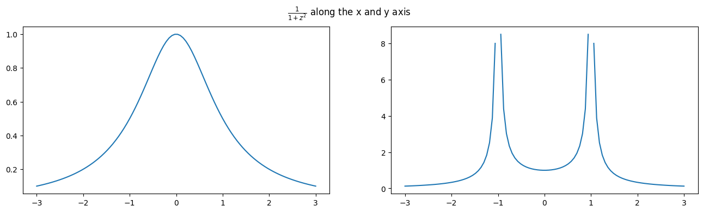
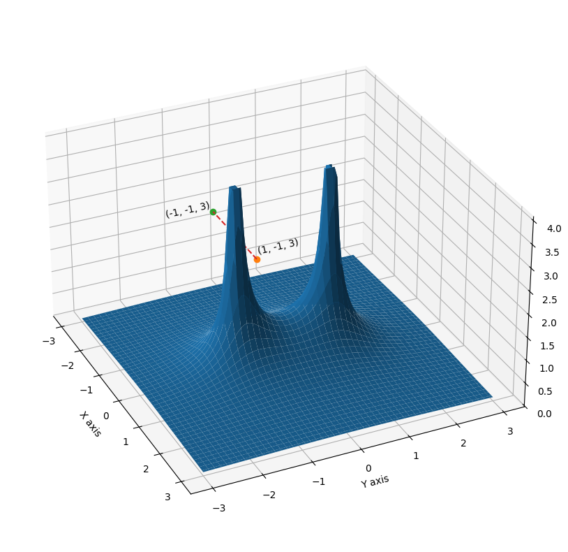
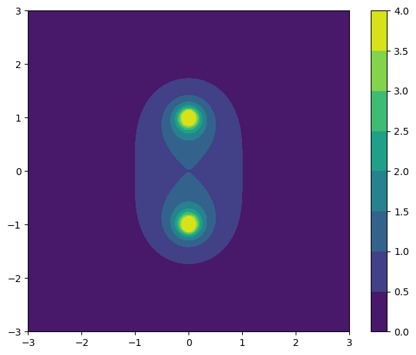
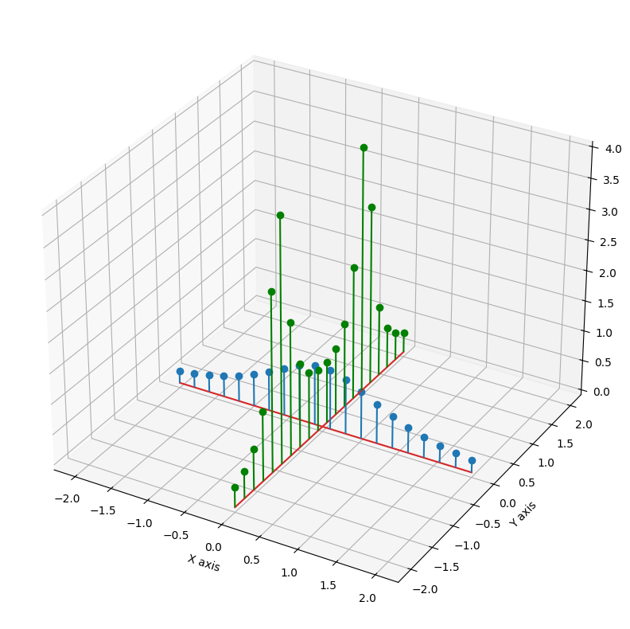

**Todo notes**
1. display $ F(z) = \frac{1}{ 1+z^2} $ modular surface in 3D and 2D plots
2. Draw circle of convergence, 
$
\displaystyle
\frac{1}{a-x}
=
\sum_{k=1}^\infty \frac{X^j}{ (a - k) ^ {j+1} }
$, iif $|X| \lt |{a-k}|$

**See also**  

*Pandas tables:*  
https://pandas.pydata.org/pandas-docs/stable/user_guide/style.html

*Subplots:*  
https://matplotlib.org/stable/gallery/subplots_axes_and_figures/subplots_demo.html  

*3D plot:*    
https://matplotlib.org/stable/gallery/mplot3d/surface3d_2.html  
https://matplotlib.org/stable/gallery/mplot3d/2dcollections3d.html  
https://matplotlib.org/stable/gallery/mplot3d/stem3d_demo.html  

*Math formulas:*  
https://en.wikibooks.org/wiki/LaTeX/Mathematics


```python
import numpy as np
import matplotlib.pyplot as plt
import pandas as pd
```


```python
def getData(n, x0, x1):
    t = np.linspace(x0, x1, n)
    t = t.reshape(n, 1)
    x1 = t
    x2 = t*1j
    
    old_err =  np.seterr(all='ignore')
    f1 = 1 / (1+x1**2)
    f2 = 1 / (1+x2**2)
    x,y = np.meshgrid(t, t)
    cp = x+1j*y
    f = 1/ (1 + cp**2)
    np.seterr(**old_err)
    
    return t, f1, f2, x, y ,f
```


```python
def plotRealAndImaginaryCut(n=100, x0=-3, x1=3):
    t, f1, f2, _, _, _ = getData(n, x0, x1)
    
    fig, axs = plt.subplots(1, 2, figsize=(16, 4))
    fig.suptitle(r'$\frac{1}{1+z^2}$ along the x and y axis')
    axs[0].plot(t, np.abs(f1))
    axs[1].plot(t, np.abs(f2))
    plt.show()

    m1 = np.abs(f1)
    m2 = np.abs(f2)
    arr1 = np.hstack([t, 1j*t, f1, f2, m1, m2])
    hdr = ['x1', 'x2', 'f1', 'f2', 'm1', 'm2']
    df = pd.DataFrame(arr1, columns=hdr)
    
    return df 
df = plotRealAndImaginaryCut()
df.style.format(precision=2).hide([row for row in df.index if row not in list(range(10))])
```


    

    


<style type="text/css">
</style>
<table id="T_f0b9a">
  <thead>
    <tr>
      <th class="blank level0" >&nbsp;</th>
      <th id="T_f0b9a_level0_col0" class="col_heading level0 col0" >x1</th>
      <th id="T_f0b9a_level0_col1" class="col_heading level0 col1" >x2</th>
      <th id="T_f0b9a_level0_col2" class="col_heading level0 col2" >f1</th>
      <th id="T_f0b9a_level0_col3" class="col_heading level0 col3" >f2</th>
      <th id="T_f0b9a_level0_col4" class="col_heading level0 col4" >m1</th>
      <th id="T_f0b9a_level0_col5" class="col_heading level0 col5" >m2</th>
    </tr>
  </thead>
  <tbody>
    <tr>
      <th id="T_f0b9a_level0_row0" class="row_heading level0 row0" >0</th>
      <td id="T_f0b9a_row0_col0" class="data row0 col0" >-3.00+0.00j</td>
      <td id="T_f0b9a_row0_col1" class="data row0 col1" >-0.00-3.00j</td>
      <td id="T_f0b9a_row0_col2" class="data row0 col2" >0.10+0.00j</td>
      <td id="T_f0b9a_row0_col3" class="data row0 col3" >-0.12-0.00j</td>
      <td id="T_f0b9a_row0_col4" class="data row0 col4" >0.10+0.00j</td>
      <td id="T_f0b9a_row0_col5" class="data row0 col5" >0.12+0.00j</td>
    </tr>
    <tr>
      <th id="T_f0b9a_level0_row1" class="row_heading level0 row1" >1</th>
      <td id="T_f0b9a_row1_col0" class="data row1 col0" >-2.94+0.00j</td>
      <td id="T_f0b9a_row1_col1" class="data row1 col1" >-0.00-2.94j</td>
      <td id="T_f0b9a_row1_col2" class="data row1 col2" >0.10+0.00j</td>
      <td id="T_f0b9a_row1_col3" class="data row1 col3" >-0.13-0.00j</td>
      <td id="T_f0b9a_row1_col4" class="data row1 col4" >0.10+0.00j</td>
      <td id="T_f0b9a_row1_col5" class="data row1 col5" >0.13+0.00j</td>
    </tr>
    <tr>
      <th id="T_f0b9a_level0_row2" class="row_heading level0 row2" >2</th>
      <td id="T_f0b9a_row2_col0" class="data row2 col0" >-2.88+0.00j</td>
      <td id="T_f0b9a_row2_col1" class="data row2 col1" >-0.00-2.88j</td>
      <td id="T_f0b9a_row2_col2" class="data row2 col2" >0.11+0.00j</td>
      <td id="T_f0b9a_row2_col3" class="data row2 col3" >-0.14-0.00j</td>
      <td id="T_f0b9a_row2_col4" class="data row2 col4" >0.11+0.00j</td>
      <td id="T_f0b9a_row2_col5" class="data row2 col5" >0.14+0.00j</td>
    </tr>
    <tr>
      <th id="T_f0b9a_level0_row3" class="row_heading level0 row3" >3</th>
      <td id="T_f0b9a_row3_col0" class="data row3 col0" >-2.82+0.00j</td>
      <td id="T_f0b9a_row3_col1" class="data row3 col1" >-0.00-2.82j</td>
      <td id="T_f0b9a_row3_col2" class="data row3 col2" >0.11+0.00j</td>
      <td id="T_f0b9a_row3_col3" class="data row3 col3" >-0.14-0.00j</td>
      <td id="T_f0b9a_row3_col4" class="data row3 col4" >0.11+0.00j</td>
      <td id="T_f0b9a_row3_col5" class="data row3 col5" >0.14+0.00j</td>
    </tr>
    <tr>
      <th id="T_f0b9a_level0_row4" class="row_heading level0 row4" >4</th>
      <td id="T_f0b9a_row4_col0" class="data row4 col0" >-2.76+0.00j</td>
      <td id="T_f0b9a_row4_col1" class="data row4 col1" >-0.00-2.76j</td>
      <td id="T_f0b9a_row4_col2" class="data row4 col2" >0.12+0.00j</td>
      <td id="T_f0b9a_row4_col3" class="data row4 col3" >-0.15-0.00j</td>
      <td id="T_f0b9a_row4_col4" class="data row4 col4" >0.12+0.00j</td>
      <td id="T_f0b9a_row4_col5" class="data row4 col5" >0.15+0.00j</td>
    </tr>
    <tr>
      <th id="T_f0b9a_level0_row5" class="row_heading level0 row5" >5</th>
      <td id="T_f0b9a_row5_col0" class="data row5 col0" >-2.70+0.00j</td>
      <td id="T_f0b9a_row5_col1" class="data row5 col1" >-0.00-2.70j</td>
      <td id="T_f0b9a_row5_col2" class="data row5 col2" >0.12+0.00j</td>
      <td id="T_f0b9a_row5_col3" class="data row5 col3" >-0.16-0.00j</td>
      <td id="T_f0b9a_row5_col4" class="data row5 col4" >0.12+0.00j</td>
      <td id="T_f0b9a_row5_col5" class="data row5 col5" >0.16+0.00j</td>
    </tr>
    <tr>
      <th id="T_f0b9a_level0_row6" class="row_heading level0 row6" >6</th>
      <td id="T_f0b9a_row6_col0" class="data row6 col0" >-2.64+0.00j</td>
      <td id="T_f0b9a_row6_col1" class="data row6 col1" >-0.00-2.64j</td>
      <td id="T_f0b9a_row6_col2" class="data row6 col2" >0.13+0.00j</td>
      <td id="T_f0b9a_row6_col3" class="data row6 col3" >-0.17-0.00j</td>
      <td id="T_f0b9a_row6_col4" class="data row6 col4" >0.13+0.00j</td>
      <td id="T_f0b9a_row6_col5" class="data row6 col5" >0.17+0.00j</td>
    </tr>
    <tr>
      <th id="T_f0b9a_level0_row7" class="row_heading level0 row7" >7</th>
      <td id="T_f0b9a_row7_col0" class="data row7 col0" >-2.58+0.00j</td>
      <td id="T_f0b9a_row7_col1" class="data row7 col1" >-0.00-2.58j</td>
      <td id="T_f0b9a_row7_col2" class="data row7 col2" >0.13+0.00j</td>
      <td id="T_f0b9a_row7_col3" class="data row7 col3" >-0.18-0.00j</td>
      <td id="T_f0b9a_row7_col4" class="data row7 col4" >0.13+0.00j</td>
      <td id="T_f0b9a_row7_col5" class="data row7 col5" >0.18+0.00j</td>
    </tr>
    <tr>
      <th id="T_f0b9a_level0_row8" class="row_heading level0 row8" >8</th>
      <td id="T_f0b9a_row8_col0" class="data row8 col0" >-2.52+0.00j</td>
      <td id="T_f0b9a_row8_col1" class="data row8 col1" >-0.00-2.52j</td>
      <td id="T_f0b9a_row8_col2" class="data row8 col2" >0.14+0.00j</td>
      <td id="T_f0b9a_row8_col3" class="data row8 col3" >-0.19-0.00j</td>
      <td id="T_f0b9a_row8_col4" class="data row8 col4" >0.14+0.00j</td>
      <td id="T_f0b9a_row8_col5" class="data row8 col5" >0.19+0.00j</td>
    </tr>
    <tr>
      <th id="T_f0b9a_level0_row9" class="row_heading level0 row9" >9</th>
      <td id="T_f0b9a_row9_col0" class="data row9 col0" >-2.45+0.00j</td>
      <td id="T_f0b9a_row9_col1" class="data row9 col1" >-0.00-2.45j</td>
      <td id="T_f0b9a_row9_col2" class="data row9 col2" >0.14+0.00j</td>
      <td id="T_f0b9a_row9_col3" class="data row9 col3" >-0.20-0.00j</td>
      <td id="T_f0b9a_row9_col4" class="data row9 col4" >0.14+0.00j</td>
      <td id="T_f0b9a_row9_col5" class="data row9 col5" >0.20+0.00j</td>
    </tr>
  </tbody>
</table>


```python
def plotModularSurface(n=100, x0=-3, x1=3, debug=False):
    _, _, _, x, y, f = getData(n, x0, x1)
    z = np.minimum(np.abs(f), 4.0)

    fig = plt.figure(figsize=(12, 10))
    ax = fig.add_subplot(projection='3d')
    ax.plot_surface(x, y, z)
    ax.set_aspect('equal')
    ax.set_xlabel('X axis')
    ax.set_ylabel('Y axis')
    ax.view_init(elev=30., azim=-25, roll=0)
    
    if debug:
        ax.plot(1, -1, 3, marker='o')
        ax.text(1, -1, 3.1, "(1, -1, 3)", 'y')
        ax.plot(-1, -1, 3, marker='o')
        ax.text(-1, -2, 3.1, "(-1, -1, 3)", 'y')
        ax.plot([1, -1 ], [-1, -1], [3, 3], linestyle='dashed' )
    
    plt.show()

plotModularSurface(debug=True)
```


    

    


```python
def plotContour(n=100, x0=-3, x1=3):
    t, _, _, x,  y, f = getData(n, x0, x1)
    z = np.minimum(np.abs(f), 4.0)

    plt.figure(figsize=(8, 6))
    plt.contourf(x, y, z)
    plt.axis('scaled')
    plt.colorbar()
    plt.show()
plotContour()
```


    

    


```python
def plotStem():
    t = np.linspace(0, 1, 20)
    a1 = -2+t*4
    b1 = t*0
    c1 = a1+1j*b1
    f1 = np.abs(1/(1+c1**2))
    
    a2 = t*0
    b2 = -2+t*4
    c2 = a2+1j*b2
    
    f2 = np.minimum(np.abs(1/(1+c2**2)), 4)
    
    fig = plt.figure(figsize=(12, 10))
    ax = fig.add_subplot(projection='3d')
    ax.stem(a1, b1, f1)
    ax.stem(a2, b2, f2, linefmt='g', markerfmt='og')
    ax.set_xlabel('X axis')
    ax.set_ylabel('Y axis')
    
    plt.show()
plotStem()
```


    

    


```python

```
